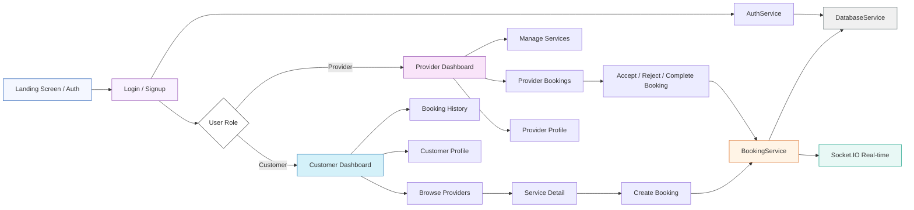

# OneTap Services — Client Presentation

## 1. Project Overview

OneTap Services is a Flutter-based mobile app that connects home service customers with service providers. It supports:
- customer booking and booking history
- provider service management and booking handling
- real-time updates for new bookings and booking status changes
- a clean animated UI with modern design components

The app runs on iOS, Android, web, and desktop via Flutter.

---

## 2. Core User Roles

### Customer
- Browse service categories
- Search providers and view service details
- Book a service with date, time, address, price, and special instructions
- View booking status and history
- Edit profile and logout

### Provider
- Manage offered services (create, update, delete)
- See pending and today’s bookings
- Accept, reject, or complete booking requests
- Receive real-time notifications for new bookings
- Update profile and logout

---

## 3. App Architecture

### How data flows

1. App starts on the **landing screen**.
2. User logs in or signs up using **AuthService**.
3. The app stores the session locally using **SharedPreferences**.
4. The correct dashboard loads depending on customer or provider role.
5. Customers create bookings through **BookingService**.
6. Providers manage bookings and services through **ProviderService** and **BookingService**.
7. Real-time updates are delivered using **Socket.IO**, so users see booking changes instantly.

---

## 4. Technical Highlights

### Authentication
- Uses API endpoints: `/auth/login` and `/auth/signup`
- Stores JWT token and user session locally
- Restores user session automatically on app launch

### Real-time updates
- Uses `socket_io_client` for WebSocket communication
- Joins rooms for both user ID and provider ID
- Automatically refreshes bookings when events arrive

### Data handling
- `DatabaseService` wraps API requests
- `BookingService` handles booking lifecycle and status updates
- `ProviderService` manages provider profile and service listings

### User interface
- Modern animated landing page
- Bottom navigation for dashboards
- Glassmorphism UI cards and hover interactions
- Responsive layout for a polished mobile experience

---

## 5. Demo Script

### Demo 1: Customer Journey

1. Open the app and show the **Landing Screen**.
2. Tap **Get Started** and go to **Login / Signup**.
3. Log in as a customer or sign up a new customer.
4. Land on **Customer Dashboard**.
5. Tap **Browse** to view providers and service categories.
6. Select a provider and open **Service Detail**.
7. Fill in booking date/time, address, and instructions.
8. Confirm booking and show the new entry in **Booking History**.
9. Highlight status updates for the booking.
10. Show **Profile** and mention logout/session persistence.

### Demo 2: Provider Journey

1. Log out and log in as a provider.
2. Show **Provider Dashboard** with pending and today booking counts.
3. Tap **Manage Services** to add or edit service offerings.
4. Show **Provider Bookings** screen with current requests.
5. Accept a booking request, then complete it.
6. Show the booking status change and how the provider sees the update.
7. Open **Profile** to view provider details and logout.

---

## 6. How to Explain It to the Client

### Use simple language
- "This app helps customers book home service professionals in a few taps."
- "Providers can list their services and manage booking requests from one dashboard."

### Focus on benefits
- Faster customer onboarding
- Real-time booking notification for providers
- Clear separation between customer and provider experiences
- One app for multiple platforms

### Show the value
- Booking becomes easy and trackable
- Providers can grow business by adding services
- The system is built for both reliability and polish

---

## 7. Suggested Next Steps

- Add **payment integration** for checkout
- Add **ratings and reviews** after service completion
- Add **in-app messaging** between customer and provider
- Add **admin dashboard** for service quality oversight

---

## 8. File Summary

This document is created for client presentation and includes:
- app overview
- architecture diagram
- customer/provider demo flow
- talking points and product benefits
